<div align="center">


<h1>Zero Trust Network Blueprint</h1>

<p><strong>The Strategic Foundation for Enterprise Network Security, Identity-Driven Micro-Segmentation, and Continuous Verification using Infrastructure as Code</strong></p>

[]()
[]()
[]()

<br/>

> **"Never trust, always verify."** 
> Zero Trust Network Blueprint (ZT-Blueprint) is an enterprise-grade platform designed to provide a secure, measurable, and highly automated foundation for global network transformation. It orchestrates the complex lifecycle of identity-driven access—from continuous authentication and adaptive policy evaluation to micro-segmentation, device posture validation, and unified security governance. By providing a centralized command center with unified zero-trust-as-code policies, automated enforcement pipelines, and immutable access logs, it enables organizations to eliminate legacy perimeter-based security, ensure least-privilege access, and drive secure digital transformation across the entire enterprise ecosystem.

</div>

---

## 🏛️ Executive Summary

Legacy perimeter-based security and fragmented access controls are strategic operational liabilities; lack of continuous verification is a primary barrier to secure cloud adoption. Organizations fail to implement Zero Trust not because of a lack of firewalls, but because of fragmented identity standards, lack of automated policy enforcement, and an inability to evaluate risk with operational precision.

This platform provides the **Security Intelligence Plane**. It implements a complete **Enterprise Zero-Trust-as-Code Framework**—from modular Identity and Policy engines to specialized Proxy and Inspection hubs. By operationalizing Zero Trust as a primary architectural pillar, it ensures that your global network stack is not just "connected," but continuously optimized and delivered with strategic performance-aligned precision.

---

## 🏛️ Core Platform Pillars

1. **Continuous Identity Verification**: High-performance engine for identity-based authentication, multi-factor challenges, and session validation.
2. **Adaptive Policy Orchestration**: Carrier-grade engine for evaluating access requests against identity, device posture, and environmental context.
3. **Identity-Driven Micro-Segmentation**: Intelligent orchestration of service-to-service isolation, mTLS-enforced links, and granular network zoning.
4. **Device Posture Intelligence**: Advanced modeling of device health signals (encryption, OS version, security software) for real-time risk scoring.
5. **Secure Access Proxy Fabric**: Carrier-grade proxy for application-level access control, session inspection, and threat detection.
6. **Unified Security Command Center**: Deep observability into access patterns, policy decisions, and global risk distribution.

---

## 📐 Architecture Storytelling: 50+ Advanced Diagrams

### 1. The Zero-Trust-as-Code Loop
*The flow from identity verification to secure micro-segmented access.*
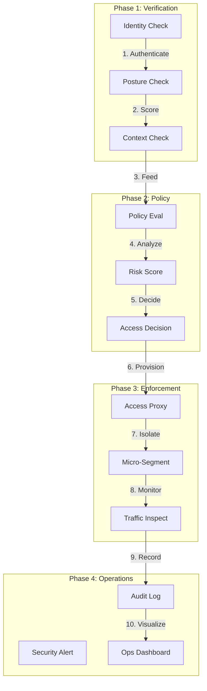

### 2. Micro-Segmentation Topology
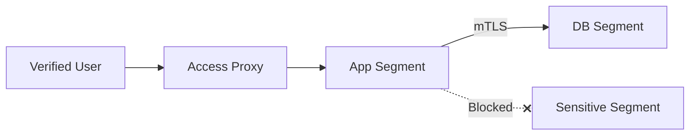

### 3. Policy Evaluation Flow
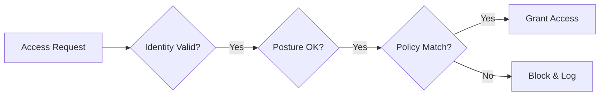

### 4. Zero Trust Architecture
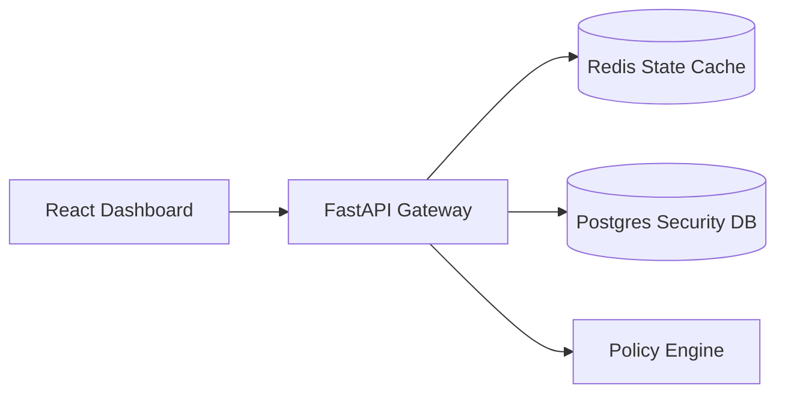

### 5. Deployment Topology: Regional Security Factory
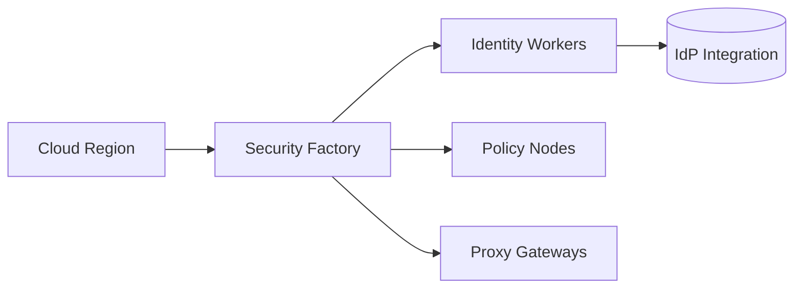

### 6. Risk Scoring Model
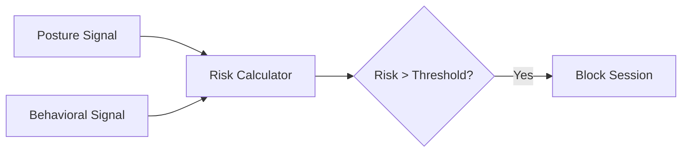

### 7. Foundation: Multi-Environment Setup
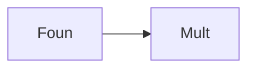

### 8. Networking: Secure Transit Gateway
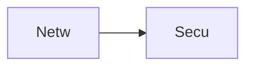

### 9. Component: Identity Engine
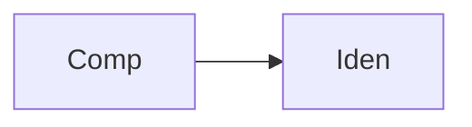

### 10. Component: Policy Engine
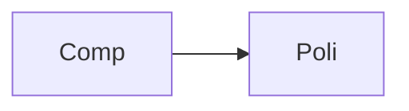

### 11. Component: Proxy Hub
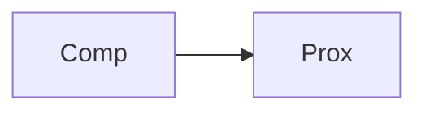

### 12. Component: Posture Engine


### 13. Logic: Continuous Authentication
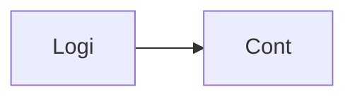

### 14. Logic: Adaptive Policy Eval
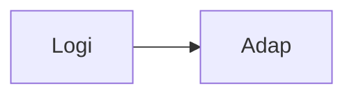

### 15. Logic: Micro-segmentation Logic
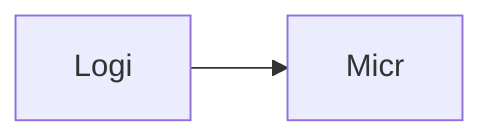

### 16. Logic: Risk-Based Blocking
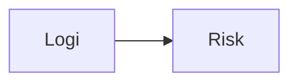

### 17. Architecture: Global Control Plane
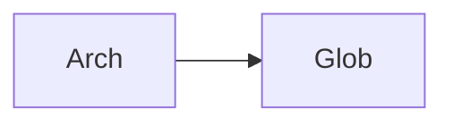

### 18. Architecture: Security Mesh
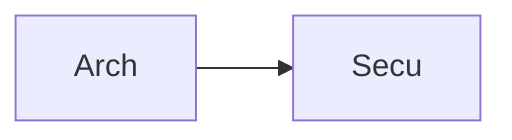

### 19. Architecture: Multi-Sink Reporting
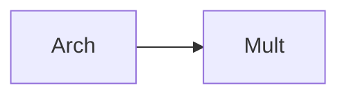

### 20. Pattern: Zero-Trust-as-Code
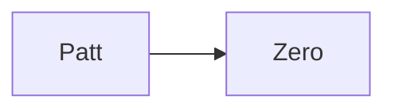

### 21. Pattern: Immutable Target Zones
```mermaid
graph LR
    P[Patt] --> I[Immu]
```

### 22. Pattern: Policy Enforcement Points
```mermaid
graph LR
    P[Patt] --> Poli[Poli]
```

### 23. Security: Signed Security Artifacts
```mermaid
graph LR
    S[Secu] --> S[Sign]
```

### 24. Security: RBAC Policy Access
```mermaid
graph LR
    S[Secu] --> R[RBAC]
```

### 25. Security: Secure Audit Record
```mermaid
graph LR
    S[Secu] --> S[Secu]
```

### 26. Feature: Access Heatmap UI
```mermaid
graph LR
    F[Feat] --> A[Acce]
```

### 27. Feature: Real-time Velocity Tailing
```mermaid
graph LR
    F[Feat] --> R[Real]
```

### 28. Feature: Auto-generated PCAPs
```mermaid
graph LR
    F[Feat] --> A[Auto]
```

### 29. Compliance: NIST ZT Audits
```mermaid
graph LR
    C[Comp] --> N[NIST]
```

### 30. Compliance: Audit Trail Persistence
```mermaid
graph LR
    C[Comp] --> A[Audi]
```

### 31. Infrastructure: Redis State Cache
```mermaid
graph LR
    I[Infr] --> R[Redi]
```

### 32. Infrastructure: Postgres Security DB
```mermaid
graph LR
    I[Infr] --> P[Post]
```

### 33. Deployment: Kubernetes Security Pods
```mermaid
graph LR
    D[Depl] --> K[Kube]
```

### 34. Deployment: Multi-Region Policy Sync
```mermaid
graph LR
    D[Depl] --> M[Mult]
```

### 35. Monitoring: verification velocity KPI
```mermaid
graph LR
    M[Moni] --> V[Veri]
```

### 36. Monitoring: posture compliance KPI
```mermaid
graph LR
    M[Moni] --> P[Post]
```

### 37. UI: Unified Security Dashboard
```mermaid
graph LR
    U[UI] --> U[Unif]
```

### 38. UI: Identity Hub UI
```mermaid
graph LR
    U[UI] --> I[Iden]
```

### 39. UI: ROI View
```mermaid
graph LR
    U[UI] --> R[ROIV]
```

### 40. UI: Risk Heatmap
```mermaid
graph LR
    U[UI] --> R[Risk]
```

### 41. CI/CD: Policy validation pipeline
```mermaid
graph LR
    C[CICD] --> P[Poli]
```

### 42. CI/CD: Security engine tests
```mermaid
graph LR
    C[CICD] --> S[Secu]
```

### 43. Strategy: Identity-First Security
```mermaid
graph LR
    S[Stra] --> I[Iden]
```

### 44. Strategy: Data-Driven Trust
```mermaid
graph LR
    S[Stra] --> D[Data]
```

### 45. Feature: Multi-Cloud Search Bridge
```mermaid
graph LR
    F[Feat] --> M[Mult]
```

### 46. Feature: Real-time Outage Alerts
```mermaid
graph LR
    F[Feat] --> R[Real]
```

### 47. Feature: Threat Forecasting
```mermaid
graph LR
    F[Feat] --> T[Thre]
```

### 48. Logic: Cost Comparison Engine
```mermaid
graph LR
    L[Logi] --> C[Cost]
```

### 49. Data Model: Security Task Entity
```mermaid
graph LR
    D[Data] --> S[Secu]
```

### 50. Enterprise Zero Trust Excellence
```mermaid
graph LR
    E[Entr] --> E[Zero]
```

---

## 🛠️ Technical Stack & Implementation

### Platform Engine & APIs
- **Framework**: Python 3.11+ / FastAPI.
- **Identity Engine**: High-performance verification of identity, credentials, and sessions.
- **Policy Engine**: Adaptive evaluation of access requests against multi-dimensional policies.
- **Segmentation Engine**: Intelligent orchestration of micro-segmentation and link isolation.
- **Posture Engine**: Real-time evaluation of device health signals and risk scoring.
- **Proxy Fabric**: Application-level access proxy for secure session management.
- **Cache**: Redis for session tracking and real-time policy status updates.
- **Persistence**: PostgreSQL for security metadata, access logs, and audit trails.
- **Observability**: Prometheus/Grafana integration for security factory monitoring.

### Frontend (Security Command Center)
- **Framework**: React 18 / Vite.
- **Theme**: Slate / Zinc (Modern Security & Zero Trust aesthetic).
- **Visualization**: Recharts for verification trends and risk distribution.

### Infrastructure
- **Runtime**: AWS EKS (Kubernetes).
- **Deployment**: Helm charts for security workers and access gateways.
- **IaC**: Terraform (Modular with Security Infrastructure focus).

---

## 🚀 Deployment Guide

### Local Development
```bash
# Clone the repository
git clone https://github.com/devopstrio/zero-trust-network-blueprint.git
cd zero-trust-network-blueprint

# Setup environment
cp .env.example .env

# Launch the Security stack (API, Engines, DB, Redis, UI)
make up

# Enforce initial Zero Trust policies
make enforce

# Simulate access requests
make simulate

# Validate security architecture
make test
```
Access the Security Dashboard at `http://localhost:3000`.

---

## 📜 License
Distributed under the MIT License. See `LICENSE` for more information.
