<div align="center">


<h1>Zero Trust Network Blueprint</h1>

<p><strong>The Strategic Foundation for Enterprise Network Security, Identity-Driven Micro-Segmentation, and Continuous Verification.</strong></p>

[]()
[]()
[]()

<br/>

> **"Never trust, always verify."** 
> **Zero Trust Network Blueprint** is an enterprise-grade platform designed to provide a secure, measurable, and highly automated foundation for global network transformation. It orchestrates the complex lifecycle of identity-driven access—from continuous authentication and adaptive policy evaluation to micro-segmentation and device posture validation.

</div>

---

## 🏛️ Executive Summary

Legacy perimeter-based security and fragmented access controls are strategic operational liabilities; lack of continuous verification is a primary barrier to secure cloud adoption. Organizations fail to implement Zero Trust not because of a lack of firewalls, but because of fragmented identity standards, lack of automated policy enforcement, and an inability to evaluate risk with operational precision.

This platform provides the **Security Intelligence Plane**. It implements a complete **Enterprise Zero-Trust-as-Code Framework**, enabling Security and Network teams to manage the zero-trust journey as a first-class citizen. By automating the verification of every request and orchestrating real-time micro-segmentation policies, we ensure that every organizational asset—from internal APIs to sensitive data lakes—is isolated by default, audited for history, and strictly protected against lateral movement and unauthorized access.

---

## 📐 Architecture Storytelling: Principal Reference Models

### 1. Principal Architecture: Global Zero Trust Network Blueprint & Security Control Plane
This diagram illustrates the end-to-end flow from user/device identification and adaptive policy evaluation to micro-segmented access, threat inspection, and institutional security auditing.

```mermaid
graph LR
    %% Subgraph Definitions
    subgraph IdentityPosture["Identity & Device Ingress"]
        direction TB
        User["User Identity (OIDC/SAML)"]
        Device["Device Posture (Intune/CrowdStrike)"]
        Context["Session Context (IP/Geo)"]
    end

    subgraph IntelligenceEngine["Zero Trust Intelligence Hub"]
        direction TB
        API["FastAPI Security Gateway"]
        PDP["Policy Decision Point (PDP)"]
        PEP["Policy Enforcement Point (PEP)"]
        Risk["Adaptive Risk Engine"]
    end

    subgraph SegmentationPlane["Hardened Micro-Segments"]
        direction TB
        AppSegment["App Service Segment"]
        DataSegment["Data Lake Segment"]
        AdminSegment["Privileged Management Zone"]
    end

    subgraph OperationsHub["Institutional Security Hub"]
        direction TB
        Scorecard["Zero Trust Maturity Score"]
        SIEM["Real-time SIEM Integration"]
        Audit["Forensic Access Metadata Lake"]
    end

    subgraph DevOps["Security-as-Code Orchestration"]
        direction TB
        TF["Terraform Security Modules"]
        Mesh["mTLS Service Mesh (Istio)"]
        Proxy["Zero Trust Access Proxy"]
    end

    %% Flow Arrows
    IdentityPosture -->|1. Submit Request| API
    API -->|2. Evaluate Risk| Risk
    Risk -->|3. Request Decision| PDP
    PDP -->|4. Push Policy| PEP
    
    PEP -->|5. Verify Identity| Mesh
    Mesh -->|6. Encrypt Link| AppSegment
    AppSegment -->|7. Access Data| DataSegment
    
    API -->|8. Visualize Health| Scorecard
    Scorecard -->|9. Track Anomalies| SIEM
    Scorecard -->|10. Record Event| Audit
    
    TF -->|11. Provision Hub| IntelligenceEngine
    Proxy -->|12. Gate External| PEP
    Audit -->|13. Harden Policies| PDP

    %% Styling
    classDef identity fill:#f5f5f5,stroke:#616161,stroke-width:2px;
    classDef intel fill:#eceff1,stroke:#455a64,stroke-width:2px;
    classDef segments fill:#e1f5fe,stroke:#01579b,stroke-width:2px;
    classDef ops fill:#e0f2f1,stroke:#004d40,stroke-width:2px;
    classDef devops fill:#fffde7,stroke:#f57f17,stroke-width:2px;

    class IdentityPosture identity;
    class IntelligenceEngine intel;
    class SegmentationPlane segments;
    class OperationsHub ops;
    class DevOps devops;
```

### 2. The Zero Trust Access Lifecycle Flow
The continuous path of an access request from initial authentication and evaluation to active authorization, micro-segmentation, and forensic auditing.

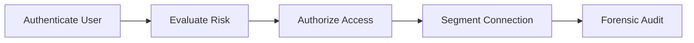

### 3. Identity-Driven Micro-Segmentation Flow
Strategically isolating workloads by cryptographically verifying the identity of the source and destination service before permitting any network communication.

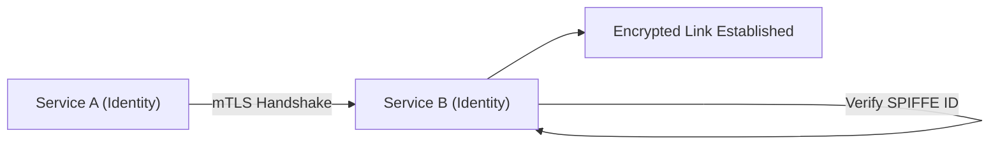

### 4. Adaptive Policy Decision Engine (PDP/PEP) Flow
Orchestrating the real-time evaluation of access requests against multi-dimensional policies including user role, device health, and environmental context.

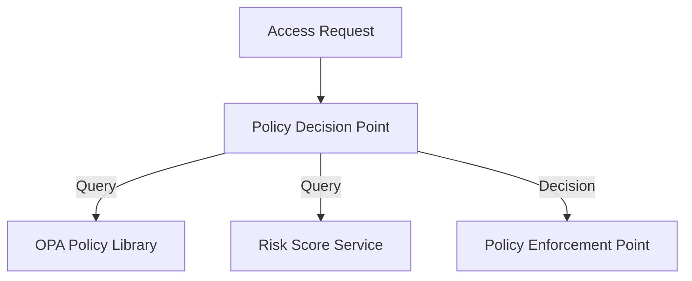

### 5. Device Posture & Health Attestation Hub
Integrating signals from endpoint management and security tools (Intune, CrowdStrike, SentinelOne) to ensure only healthy, managed devices can access sensitive resources.

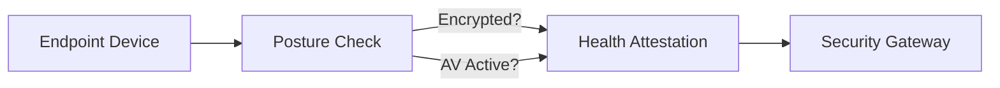

### 6. Secure Access Service Edge (SASE) Topology
Merging SD-WAN capabilities with cloud-native security (SWG, CASB, ZTNA) to provide a unified, secure edge for the global hybrid workforce.

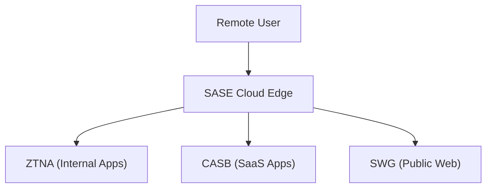

### 7. mTLS-Enforced Service Mesh Architecture
Protecting east-west traffic within the data center or cloud region by enforcing mutual TLS and fine-grained authorization policies at the proxy level.

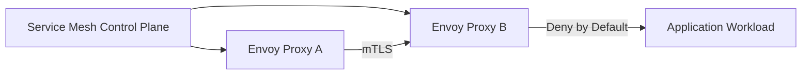

### 8. Institutional Zero Trust Scorecard
Grading organizational security performance based on key indicators: Verification Depth, Blast Radius Containment, and Mean Time to Detection (MTTD).

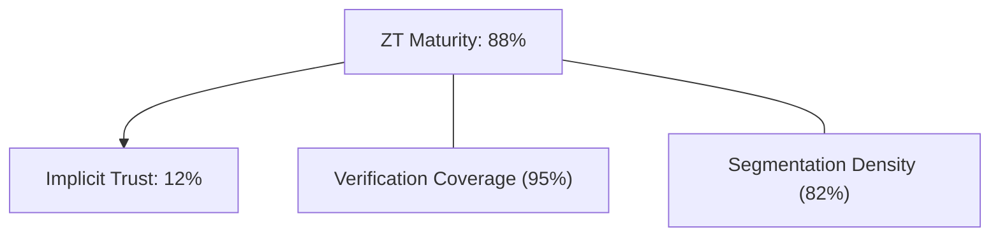

### 9. Identity & RBAC for Security Governance
Managing fine-grained access to security policies, risk thresholds, and access logs between Security Architects, SOC Analysts, and Policy Administrators.

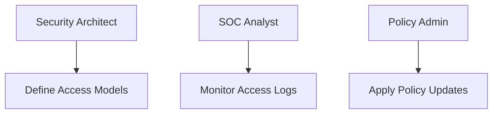

### 10. IaC Deployment: Security-as-Code Framework
Using Terraform to deploy and manage the versioned distribution of the zero-trust hubs, access proxies, and forensic metadata lakes.

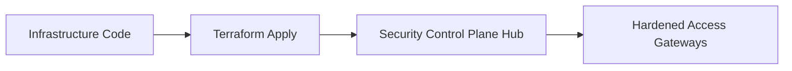

### 11. Metadata Lake for Forensic Access Audit
Storing long-term records of every verification event, policy decision, and anomalous access attempt for institutional record-keeping and investigation.

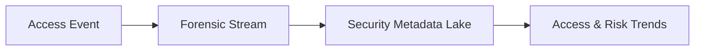

---

## 🏛️ Core Security Pillars

1.  **Continuous Verification**: Explicitly authenticating and authorizing every request, regardless of source location.
2.  **Least Privilege Access**: Limiting user and service access to only the specific resources required for their function.
3.  **Identity-Based Segmentation**: Moving from IP-based firewalls to cryptographically-verified identity boundaries.
4.  **Adaptive Risk Evaluation**: Dynamically adjusting access based on real-time device health and session context.
5.  **Micro-Perimeter Defense**: Hard-fencing every individual workload and data repository within the network.
6.  **Full Access Auditability**: Immutable recording of every security decision and network interaction for institutional forensics.

---

## 🛠️ Technical Stack & Implementation

### Security Engine & APIs
*   **Framework**: Python 3.11+ / FastAPI.
*   **Policy Decision Core**: Integration with OPA (Open Policy Agent) for high-performance policy evaluation.
*   **Identity Orchestrator**: Multi-provider support (Entra ID, Okta, Auth0) with SPIFFE/Spire integration.
*   **Risk Engine**: Adaptive scoring based on IP reputation, geo-velocity, and device attestation.
*   **State Management**: PostgreSQL (Metadata Lake) and Redis (Policy Cache).

### Security Dashboard (UI)
*   **Framework**: React 18 / Vite.
*   **Theme**: Slate, Zinc, Charcoal (Modern high-trust aesthetic).
*   **Visualization**: Recharts for maturity scoring, risk distribution, and access success rates.

### Infrastructure & DevOps
*   **Runtime**: AWS EKS or Azure Kubernetes Service (AKS).
*   **Mesh Fabric**: Istio with Envoy sidecars for transparent mTLS enforcement.
*   **IaC**: Modular Terraform for deploying the security hub and access gateway distributions.

---

## 🏗️ IaC Mapping (Module Structure)

| Module | Purpose | Real Services |
| :--- | :--- | :--- |
| **`infrastructure/sec_hub`** | Central management plane | EKS, PostgreSQL, Redis |
| **`infrastructure/proxies`** | Zero Trust Access Gateways | Envoy, Cloudfront, WAF |
| **`infrastructure/policy`** | Policy-as-Code library | OPA, Rego, Git |
| **`infrastructure/auditing`** | Forensic security sinks | S3, Athena, Quicksight |

---

## 🚀 Deployment Guide

### Local Principal Environment
```bash
# Clone the security platform
git clone https://github.com/devopstrio/zero-trust-network-blueprint.git
cd zero-trust-network-blueprint

# Configure environment
cp .env.example .env

# Launch the Security stack
make up

# Trigger a mock access request and policy evaluation simulation
make simulate-access
```

Access the Security Dashboard at `http://localhost:3000`.

---

## 📜 License
Distributed under the MIT License. See `LICENSE` for more information.

---
<div align="center">
  <p>© 2026 Devopstrio. All rights reserved.</p>
</div>
